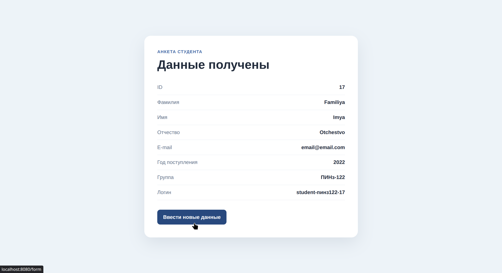

# Лабораторная работа № 1 - Spring Boot и Thymeleaf

## Цель работы

Создать веб-приложение на Spring Boot с Thymeleaf, передавать данные из контроллера в страницы и принимать данные формы студента. По году поступления приложение формирует название группы и логин для образовательного портала.

## Архитектура проекта

- **Стек:** Java 17, Spring Boot 3, Maven, Spring Web, Thymeleaf.
- **Основные части:**
  - `MainController` - обрабатывает запросы страниц и передаёт данные в шаблоны;
  - `Student` - хранит поля анкеты и формирует группу и логин;
  - `templates` - HTML-шаблоны Thymeleaf для главной страницы, страницы автора, формы и результата;
  - `static/css/style.css` - стили страниц.
- **Ключевые аннотации:** `@SpringBootApplication` запускает приложение; `@Controller` отмечает контроллер; `@GetMapping` и `@PostMapping` связывают методы с HTTP-запросами; `@RequestParam` читает имя автора из параметра запроса; `@ModelAttribute` получает данные формы.

## Алгоритм работы

1. При GET-запросе `/` контроллер передаёт заголовок и текст главной страницы в шаблон `main.html`;
2. Страница `/about?name=Имя` показывает указанное имя автора. Если параметр `name` не задан, используется значение «Имя автора»;
3. При открытии `/form` создаётся пустой объект `Student`, который связывается с полями формы;
4. Форма отправляет ID, имя, фамилию, отчество, e-mail и год поступления POST-запросом на `/form`;
5. Класс `Student` формирует группу по последним двум цифрам года поступления в формате `ПИНз-1XX`, а логин - по шаблону `student-<группа без дефиса в нижнем регистре>-<ID>`;
6. Контроллер передаёт заполненный объект в `result.html`, где отображаются введённые данные, группа и логин.

## Скриншоты работы приложения

### Главная страница

### Заполнение анкеты студента

### Отображение анкеты студента

### Информация об авторе страницы

